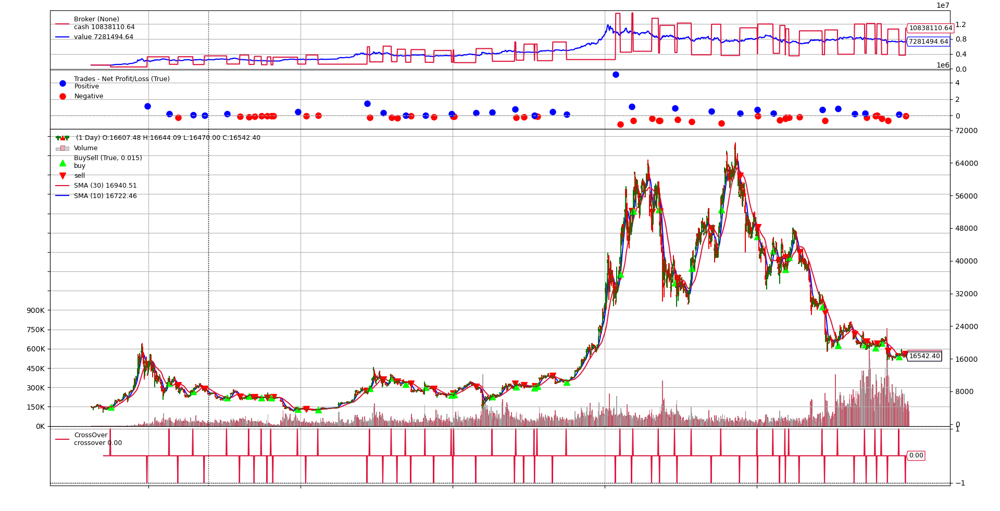

# Backtrader Backtesting
An example of a trading strategy tester using Backtrader

## Installation


```
make init
source venv/bin/activate
```

Installing dependencies
```
make install
```

## Results



```
[BTC/USDT] 요청한 시작시간 데이터가 CCXT에 존재하지 않습니다 시작시간 재조정 : 2017-01-01 00:00:00 -> 2017-08-17 00:00:00
[1d] 현재수행 횟수 / 남은횟수 :: 772 / 1963
[1d] 현재수행 횟수 / 남은횟수 :: 1772 / 1963
[1d] 현재수행 횟수 / 남은횟수 :: 1963 / 1963
CCXT 데이터 조회 완료 2017-08-17 00:00:00 ~ 2022-12-31 00:00:00
* 스타트 금액 : 1,000,000 $

+-----+-------+---------------------+----------+---------------------+----------+--------+-------------+--------+------+-------------+------------+------+------------+--------+--------+
| ref | 포지션종류 | 진입일                 | 진입가      | 청산일                 | 청산가      | 가격변동%  | 손익          | 손익%    | size | value       | 누적손익       | 캔들갯수 | 손익/캔들갯수    | mfe%   | mae%   |
+-----+-------+---------------------+----------+---------------------+----------+--------+-------------+--------+------+-------------+------------+------+------------+--------+--------+
| 1   | long  | 2017-10-03 09:00:00 | 4380.0   | 2017-12-30 09:00:00 | 14378.99 | 228.29 | 1139029.45  | 49.91  | 114  | 499320.0    | 1139029.45 | 88   | 12943.52   | 352.02 | -6.16  |
| 2   | short | 2017-12-30 09:00:00 | 14378.99 | 2018-02-21 09:00:00 | 11195.07 | -22.14 | 234853.09   | 10.24  | -74  | -1064045.26 | 1373882.54 | 53   | 4431.19    | 58.27  | -19.45 |
| 3   | long  | 2018-02-21 09:00:00 | 11195.07 | 2018-03-14 09:00:00 | 9151.92  | -18.25 | -215385.32  | -9.48  | 105  | 1175482.35  | 1158497.21 | 21   | -10256.44  | 4.6    | -29.43 |
| 4   | short | 2018-03-14 09:00:00 | 9151.92  | 2018-04-19 09:00:00 | 8173.99  | -10.69 | 113606.96   | 4.97   | -117 | -1070774.64 | 1272104.17 | 36   | 3155.75    | 29.74  | -1.99  |
| 5   | long  | 2018-04-19 09:00:00 | 8173.99  | 2018-05-16 09:00:00 | 8462.0   | 3.52   | 39108.43    | 1.68   | 139  | 1136184.61  | 1311212.6  | 27   | 1448.46    | 22.58  | -1.15  |
| 6   | short | 2018-05-16 09:00:00 | 8462.0   | 2018-07-09 09:00:00 | 6712.1   | -20.68 | 237160.93   | 9.34   | -136 | -1150832.0  | 1548373.53 | 54   | 4391.87    | 32.05  | -1.74  |
| 7   | long  | 2018-07-09 09:00:00 | 6712.1   | 2018-08-09 09:00:00 | 6283.27  | -6.39  | -82031.32   | -3.39  | 189  | 1268586.9   | 1466342.21 | 31   | -2646.17   | 26.51  | -9.57  |

                ...............................

| 64  | short | 2022-08-23 09:00:00 | 21400.75 | 2022-09-17 09:00:00 | 19803.3  | -7.46  | 294060.12   | 3.52   | -186 | -3980539.5  | 7290096.51 | 25   | 11762.4    | 13.5   | -6.53  |
| 65  | long  | 2022-09-17 09:00:00 | 19803.3  | 2022-09-21 09:00:00 | 18874.31 | -4.69  | -197392.36  | -2.41  | 209  | 4138889.7   | 7092704.15 | 4    | -49348.09  | 1.95   | -8.47  |
| 66  | short | 2022-09-21 09:00:00 | 18874.31 | 2022-10-12 09:00:00 | 19060.0  | 0.98   | -42984.84   | -0.53  | -214 | -4039102.34 | 7049719.32 | 21   | -2046.9    | 3.96   | -8.48  |
| 67  | long  | 2022-10-12 09:00:00 | 19060.0  | 2022-10-16 09:00:00 | 19068.4  | 0.04   | -1445.64    | -0.02  | 211  | 4021660.0   | 7048273.68 | 4    | -361.41    | 4.68   | -4.56  |
| 68  | short | 2022-10-16 09:00:00 | 19068.4  | 2022-10-27 09:00:00 | 20771.61 | 8.93   | -362739.81  | -4.78  | -211 | -4023432.4  | 6685533.87 | 11   | -32976.35  | 2.19   | -10.23 |
| 69  | long  | 2022-10-27 09:00:00 | 20771.61 | 2022-11-11 09:00:00 | 17602.45 | -15.26 | -589134.28  | -8.18  | 185  | 3842747.85  | 6096399.59 | 15   | -39275.62  | 3.41   | -24.96 |
| 70  | short | 2022-11-11 09:00:00 | 17602.45 | 2022-12-08 09:00:00 | 16836.64 | -4.35  | 151158.91   | 2.06   | -201 | -3538092.45 | 6247558.5  | 27   | 5598.48    | 12.08  | -0.53  |
| 71  | long  | 2022-12-08 09:00:00 | 16836.64 | 2022-12-24 09:00:00 | 16778.52 | -0.35  | -15386.7    | -0.21  | 215  | 3619877.6   | 6232171.79 | 16   | -961.67    | 9.21   | -3.45  |
+-----+-------+---------------------+----------+---------------------+----------+--------+-------------+--------+------+-------------+------------+------+------------+--------+--------+

MDD : 43.25, CAGR: 29.03, SHARP: 0.79
* 최종 금액 : 7,281,494 $
수익률 :  628.1494641728002 %

```
